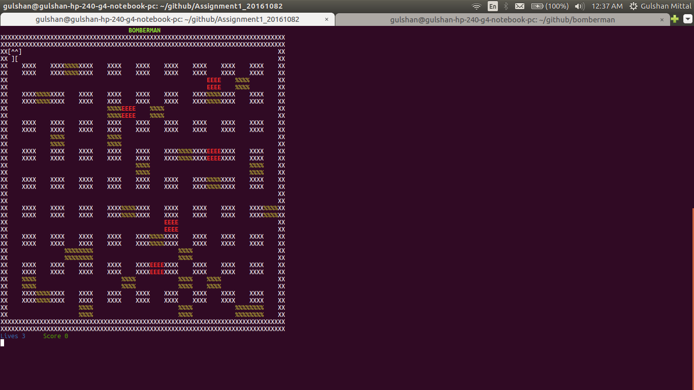

BOMBERMAN	
=========




The project is written in python3 and the source code for the same is stored in the src directory.

## Running the game 
The game can be run by running the following code in the terminal. 
``` python3 game.py ```

## Basic Controls
	* w - Up
	* s - Down
	* a - Left
	* d - Right
	* b - Place Bomb
	* q - Quit the game

## Symbols

* Bricks - %
* Bomb - [B] -> [time]
* Walls - X
* Enemies - E
  * Bomberman - P		 		
* Explosion - e

## Lives and Score 
* Displayed in the frame and information about levels come before the cuuren level on the screen

## Classes
The game contains several classes each of which represents an object in the game. These are as follows:-

* Encapsulation ,inheritance,modularity and ploymorphism is present in the game codes.
* Board (Encapsulation) - This  class is making board of the game which includes side Walls and Walls in board
* Bricks (Encapsulatoin) - This class is making brick randomly at that position where there is no wall.
* Person - Parent class for all the moving objects
  * Bomberman (inheritance)- Class to implement the main player in the game, the bomberman which will be operated by the user.
  * Enemy (inheritance)- Class to implement the antagonist of the game, which will move according to the difficulty of the game.
* Bomb - This class is making bomb and give time remaining in exploding in it and then explode it.
* Getch - Gets a single character from standard input.  Does not echo to the screen.  


#### Board 
	It defines the main board that is displayed to the user in the game.It contains all the element bricks,Walls,enemies,bomberman
* Methods - `__init()__` , `make_board()`
* Properties - Make complete 2-D board and places the right elements in desired postion.


#### Player (Bomberman)

	It defines the main person of the game i.e., Bomberman which is controlled by the user input.
* Methods - `__init__()` ,`getPosplanter()`, `remove()`, `curr()`, `hanged()`, `hanged_bomber()`
* Properties - x_pos, y_pos, lives, score


#### Bomb

	It defines the bombs which can be placed by the bomberman on the board and destroy the bricks and the enemies
* Methods - `__init__()`,`explosion()`,`explode()` ,`presentCoordiateBomb()` ,` set_bomb()` ,`startcounter()`
* Properties - x_pos, y_pos, timer


#### Bricks

	It defines the destructible types of wall which can be destroyed by bombs
* Methods - `__init__()`
* Properties - x_pos, y_pos,


### Person

	Parent class for the moving objects which are enemies and the bomberman (player)
* Methods - `_init_()`,`leftMove()`,`rightMove()`,`upMove()` ,`downMove()`
* Properties - x_pos, y_pos,left move,right move,up ,down


#### Enemy

	It defines the enemies for the game which are made to move through an algorithm which makes their moves random . 
* Methods - `__init__()`, `hanged_enemy()`, `currEnemy()`, `removeEnemy()`, `checkmurder()`, `destroy()`
* Properties - x_pos, y_pos,speed increses on every level and also its number
